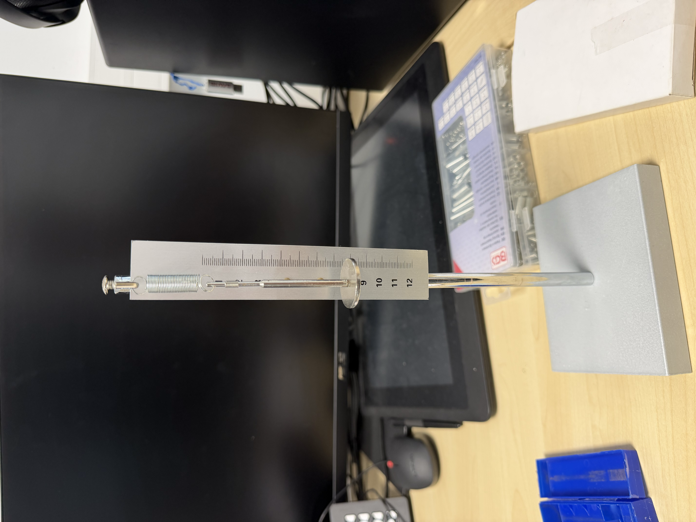
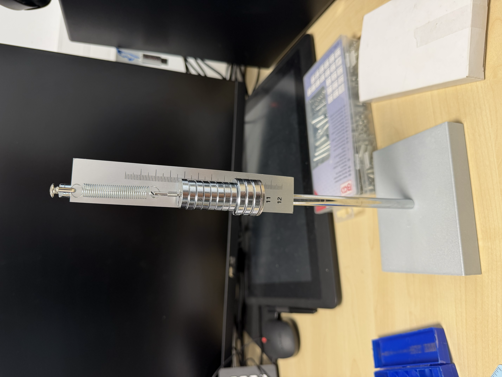
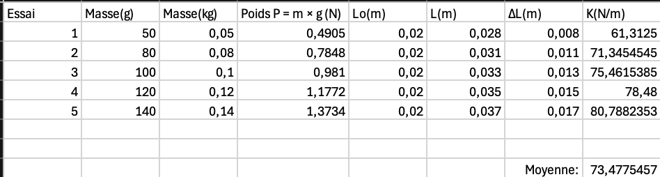
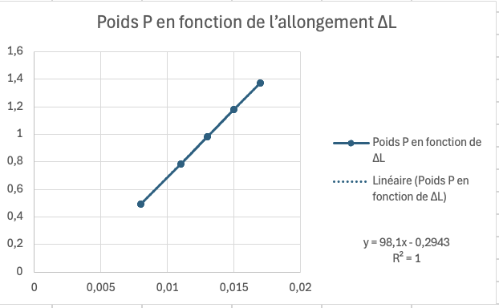

# Expérience sur le ressort

Cette expérience a pour objectif de déterminer la raideur réelle du ressort de traction utilisé pour la catapulte.

---

## 1. Principe de l'expérience

Une masse connue est suspendue au ressort.

Le poids de cette masse provoque un allongement du ressort.

Lorsque la masse est immobile, le poids et la force de rappel du ressort se compensent.

On a donc :

P = T

avec :

P = m × g

et :

T = k × ΔL

On obtient alors :

k = (m × g) / ΔL

Cette relation permet de calculer la raideur du ressort à partir d'une masse connue et de l'allongement mesuré.

---

## 2. Matériel utilisé

Le montage expérimental est composé de :

- un ressort de traction
- un support vertical
- une règle graduée
- plusieurs masses connues

Le ressort utilisé a été pris dans la partie inférieure droite de la boîte de ressorts disponible au MakerSpace.

---

## 3. Mesure de la longueur au repos

Avant de suspendre les masses, la longueur du ressort a été mesurée.

La longueur obtenue est :

L₀ = 2 cm = 0,020 m

---

## 4. Protocole expérimental

Plusieurs masses ont été suspendues au ressort :

- 50 g
- 80 g
- 100 g
- 120 g
- 140 g

Pour chaque masse :

1. la masse est suspendue au ressort
2. la nouvelle longueur du ressort est mesurée
3. l'allongement est calculé avec :

ΔL = L - L₀

4. le poids de la masse est calculé avec :

P = m × g

5. la raideur est calculée avec :

k = P / ΔL

---

## 5. Résultats expérimentaux

Les différentes mesures et les calculs ont été regroupés dans un tableau Excel.

La raideur moyenne obtenue avec les différents essais est d'environ :

k ≈ 73,5 N/m

Cette valeur est retenue comme valeur expérimentale de la raideur du ressort pour la suite du projet.

---

## 6. Analyse graphique

Le poids P a été représenté en fonction de l'allongement ΔL.

Sur ce graphique :

- l'axe horizontal x représente l'allongement ΔL en mètres
- l'axe vertical y représente le poids P en newtons

La droite de tendance obtenue est :

P = 98,1 × ΔL - 0,2943

avec :

R² = 1

Les différents points sont alignés.

Cela montre que, sur la plage de masses utilisée, l'allongement du ressort augmente de manière linéaire lorsque le poids appliqué augmente.

Le coefficient R² = 1 indique que les points expérimentaux sont alignés avec la droite de tendance.

La droite ne passe cependant pas exactement par l'origine. Cela peut être lié à la précision des mesures de longueur ou au comportement réel du ressort utilisé.

La valeur moyenne retenue pour la suite de l'étude est :

k ≈ 73,5 N/m

---

## 7. Conclusion

L'expérience a permis de déterminer expérimentalement la raideur du ressort utilisé pour la catapulte.

La valeur retenue est :

k ≈ 73,5 N/m
