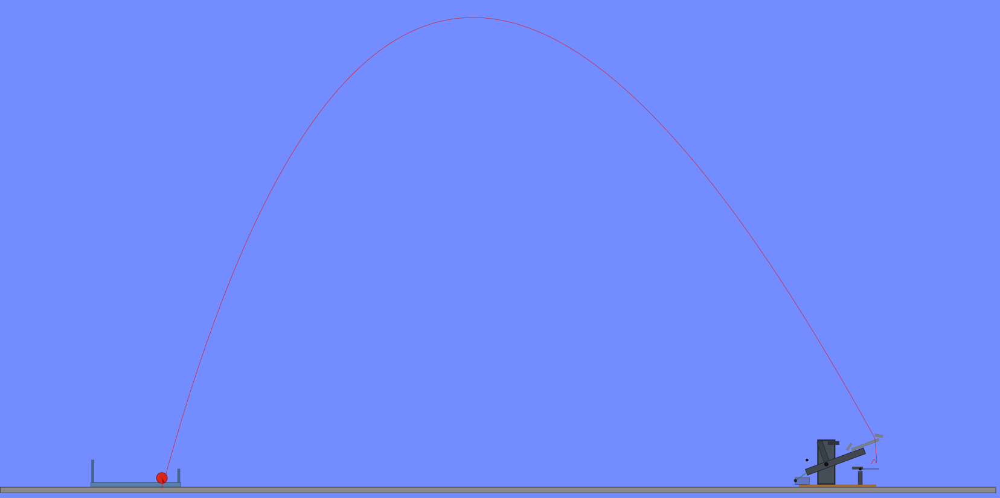

## Jeudi 20 août 2026

Présentation du projet

Découverte de la documentation technique

Création du repo GitHub : [https://github.com/Zacak/catapulte](https://github.com/Zacak/catapulte)

Mise en place de la documentation continue sur le site

Analyse du cahier des charges : [Documentation MakerSpace](https://doc.makerspace-amiens.fr/workshops/medieval-challenge/concepts/medieval-challenge/informations/)

Recherche des différents phénomènes physiques et formules

### Formules physiques utilisées

- Loi de Hooke
- Énergie potentielle élastique
- Moment de force / couple mécanique
- Équation du mouvement horizontal du projectile
- Équation du mouvement vertical du projectile
- Trajectoire parabolique

Premier croquis effectué

Approximations des dimensions pour la catapulte

Base : 170 × 170 × 5 mm

Bras : 150 mm

Distance de l’axe à la balle : 125 mm

Hauteur de l’axe : 45 mm

Support : 55 mm

Réflexion sur le choix du système de propulsion (ressort) et du mécanisme de déclenchement

## Mise en place de la documentation

J’ai commencé à structurer le site de documentation du projet afin de présenter de manière claire les différentes étapes de conception.

Les premières pages ont été complétées avec :

- la présentation du projet 
- les objectifs 
- le cahier des charges 

Cette documentation sera mise à jour progressivement au fur et à mesure de l’avancement du projet.
Lien du site:

## Vendredi 21 août 2026

Recherche de différents modèles de catapultes existants

Choix de la Catapulte H comme base d’inspiration

Réflexion sur l’adaptation de la Catapulte H avec un ressort

Choix d’une base fixe de 170 × 170 × 5 mm

Réflexion sur le positionnement du ressort sur la partie arrière du bras

Étude du système de rotation du bras avec une tige filetée

Ajout de rondelles et d’entretoises pour maintenir le bras centré sur l’axe

Réflexion sur le système de déclenchement avec une languette et une corde de 50 cm

Identification des pièces pouvant être réalisées en bois :

- base
- montants du H
  
Début de la modélisation 3D de la catapulte

Création de la base de 170 × 170 × 5 mm

Modélisation des deux montants permettant de maintenir le bras

Ajout des trous traversants dans les montants pour le passage de la tige filetée servant d’axe de rotation

Réflexion sur l’écartement entre les deux montants afin de pouvoir ajouter le bras et les rondelles 

### Mise à jour du site

Réorganisation du site afin de mieux l’adapter au projet.

Modifications réalisées :

- création de la page: Préparation du projet 
- ajout de la page: Modélisation 3D 
- réorganisation du menu 
- ajout des premières images du projet 
- mise à jour de la documentation continue

## Lundi 24 août 2026

Poursuite de la modélisation 3D de la catapulte

Amélioration de la base et du support en H

Modélisation du bras de lancement

Ajout de la partie permettant de recevoir le projectile

Vérification du positionnement du bras entre les deux montants

Modélisation du système de fixation du ressort

Réflexion sur le positionnement du ressort afin qu’il agisse correctement sur la partie arrière du bras

Modélisation du système de blocage permettant de maintenir le bras en position armée

Création du support de blocage

Création de l’axe de blocage

Modélisation des pièces de centrage

Ajout des pièces de centrage de chaque côté du bras afin de limiter ses déplacements latéraux

Ajout de la tige servant d’axe de rotation du bras

Assemblage des différentes pièces afin de vérifier leur positionnement

Vérification de la rotation et du centrage du bras autour de son axe

Modification de la longueur et du positionnement du bras afin de respecter l’encombrement maximal imposé

Vérification des dimensions de l’assemblage complet par rapport au cahier des charges

Dimensions actuelles de l’assemblage : environ 170 × 196 × 105 mm

L’ensemble reste donc dans le volume maximal autorisé de 200 × 200 × 200 mm

### Pièces modélisées

- plateau
- support en H
- bras de lancement
- fixation du ressort
- support de blocage
- axe de blocage
- pièces de centrage
- axe de rotation du bras

### Mise à jour du site

Mise à jour de la page Modélisation 3D

Ajout des différentes pièces modélisées sur le site

Ajout d’une visualisation 3D interactive des fichiers 3d

## Mardi 25 août 2026

Travail principalement consacré à la partie physique du projet

Étude du fonctionnement du ressort et de son influence sur le lancement

Mesure du ressort utilisé pour le prototype :

- longueur au repos : environ 3 cm
- longueur pouvant être atteinte sans forcer excessivement : environ 6 cm
- allongement envisagé : environ 3 cm

loi de Hooke :

F = k × Δx

Énergie potentielle élastique stockée dans le ressort :

E = 1/2 × k × (Δx)²

Recherche et ajout de schémas explicatifs afin de mieux comprendre les différentes formules physiques

Étude de la trajectoire du projectile après son lancement

Décomposition de la vitesse initiale en une composante horizontale et une composante verticale

Réflexion sur les paramètres pouvant influencer la portée du projectile :

- raideur du ressort
- allongement du ressort
- angle de lancement
- hauteur de départ

### Simulation avec Algodoo

Création d’une première simulation simplifiée de la catapulte avec Algodoo

Adaptation progressive de la simulation afin de la rapprocher de la modélisation 3D du prototype

Modification du positionnement du bras et du système de blocage afin de représenter correctement la position armée de la catapulte

Ajustement de la position du ressort en fonction de la modélisation 3D

Utilisation du ressort avec une longueur au repos de 30 mm dans la simulation

Réalisation de premiers essais de lancement dans Algodoo

Observation d’une trajectoire approximativement parabolique du projectile

 

Les résultats obtenus seront ensuite comparés aux mesures réalisées avec la catapulte réelle afin d’analyser les écarts entre la théorie, la simulation et l’expérience.

Début de la création d’une page dédiée à l’étude physique sur le site pour regrouper les formules, les schémas, la simulation Algodoo puis les futurs résultats expérimentaux.

## Mercredi 26 août 2026
 
Poursuite du travail sur la partie physique du projet.

Préparation des calculs à faire valider.

Identification du ressort utilisé comme étant un ressort de traction.

### Modélisation 3D

Poursuite de l'amélioration de l'assemblage.

Réflexion sur l'intégration du ressort de traction dans la modélisation 3D.

Identification des deux points d'accroche du ressort :

- un point d'accroche sur la partie arrière du bras
- un point d'accroche fixe sur la base

Vérification du positionnement de ces deux points afin que le ressort puisse agir correctement sur le bras.

Création d'un premier modèle 3D du ressort.

Ajout du ressort dans l'assemblage pour vérifier son positionnement entre le point d'accroche du bras et le point fixe situé sur la base.

Cette intégration permet de mieux visualiser le fonctionnement du mécanisme et de vérifier que le ressort est correctement orienté par rapport au bras.

### Préparation de la partie expérimentale

Réflexion sur la manière d'obtenir les valeurs réelles nécessaires aux calculs :

- utilisation de masses connues pour déterminer la raideur réelle du ressort
- mesure de la masse du projectile
- mesure de la hauteur de lancement
- détermination de l'angle de lancement
- réflexion sur la méthode permettant de déterminer la vitesse initiale du projectile

Étude du TP de bille sur rail (première année) afin de voir comment appliquer les équations de trajectoire à partir de mesures expérimentales.

L'objectif sera dans un premier temps de vérifier la méthode avec le matériel du TP, puis l'appliquer ensuite à la catapulte afin de comparer les résultats calculés aux résultats obtenus lors des tirs réels afin de savoir si une erreur a était commise.

### Mise à jour de la modélisation 3D

Mise à jour de la page Modélisation 3D du site.

Ajout du ressort de traction parmi les éléments modélisés.

Ajout de l'assemblage complet de la catapulte afin de visualiser l'ensemble des différentes pièces.

## Jeudi 27 août 2026

Correction du problème de publication de la documentation continue du mercredi 26 août.

Poursuite du travail sur la partie physique du projet.

Finalisation de la fiche regroupant les principales formules qui seront utilisées pour l’étude de la catapulte.

Réalisation d’exemples de calculs avec des valeurs provisoires afin de comprendre les différentes formules.

Envoi de la fiche de calculs au professeur de physique afin de faire valider les formules et la méthode avant de passer à la partie expérimentale.

### Étude de la trajectoire

Poursuite de la réflexion sur la méthode permettant d’étudier expérimentalement la trajectoire du projectile.

Prévision d’utiliser dans un premier temps le matériel du TP de bille sur rail.

La méthode pourra ensuite être adaptée au prototype réel de la catapulte.

### Mise à jour du site

Poursuite de la création de la page Étude physique.

Ajout et organisation des différentes parties :

- fonctionnement physique de la catapulte
- loi de Hooke
- énergie potentielle élastique
- trajectoire du projectile
- simulation avec Algodoo
- préparation de la future partie expérimentale

Préparation de tableaux qui seront complétés avec les valeurs réelles lors des futurs essais.

Réorganisation de certaines parties du site afin de rendre la documentation plus claire.

Création de la page Cahier des charges et contraintes afin de regrouper les principales contraintes du projet.

Modification de la page Études et choix techniques afin de mieux présenter les différentes études réalisées dans le cadre du projet.

## Vendredi 28 août 2026

Travail principalement consacré à la partie physique du projet.

Identification du système étudié comme étant la masse suspendue au ressort.

Réalisation du bilan des forces appliquées sur cette masse :

- le poids P dirigé vers le bas
- la force de rappel du ressort T dirigée vers le haut

Lorsque la masse est immobile, elle est à l'équilibre.

### Expérience sur le ressort

Mise en place d'un montage expérimental avec :

- un ressort de traction
- un support vertical
- des masses connues
- une règle graduée

Mesure de la longueur du ressort au repos :

L₀ = 2 cm

Réalisation de plusieurs essais avec les masses suivantes :

- 50 g
- 80 g
- 100 g
- 120 g
- 140 g

Pour chaque essai :

- mesure de la longueur du ressort après ajout de la masse
- calcul de l'allongement ΔL
- calcul du poids P = m × g
- calcul de la raideur k

Les résultats ont été regroupés dans un tableau Excel afin d'automatiser les calculs.

La raideur moyenne obtenue est d'environ :

k ≈ 73,5 N/m

Cette valeur est retenue pour la suite de l'étude.

### Analyse graphique

Création d'un graphique représentant le poids P en fonction de l'allongement ΔL.

Sur le graphique :

- l'axe horizontal x représente l'allongement ΔL en mètres
- l'axe vertical y représente le poids P en newtons

Ajout d'une droite de tendance.

Les différents points sont alignés.

Cela montre que sur les différentes masses utilisée, l'allongement du ressort augmente de manière linéaire lorsque le poids appliqué augmente.

Le coefficient R² = 1 indique que les points expérimentaux sont alignés avec la droite de tendance.

La droite ne passe cependant pas exactement par l'origine. Ce décalage pourra être lié notamment à la précision des mesures ou au comportement réel du ressort.

### Mise à jour du site

Réorganisation de la partie physique du site afin de mieux séparer la théorie et l'expérience.

Mise à jour de la page Étude physique avec :

- la loi de Hooke
- le bilan des forces
- l'énergie potentielle élastique
- la trajectoire du projectile
- la portée
- la simulation avec Algodoo

Création d'une nouvelle page Expérience sur le ressort afin de regrouper :

- le principe de l'expérience
- le matériel utilisé
- la mesure de la longueur au repos du ressort
- le protocole expérimental
- les résultats obtenus sous Excel
- le graphique représentant le poids en fonction de l'allongement
- l'analyse du graphique
- la valeur moyenne de la raideur obtenue

La valeur expérimentale retenue pour la raideur du ressort est :

k ≈ 73,5 N/m

## Lundi 31 août 2026

Travail principalement consacré à la préparation de la présentation intermédiaire du projet.

### Préparation du diaporama

Création et organisation d'un diaporama présentant l'état actuel du projet.

La présentation est structurée autour des parties suivantes :

- présentation du projet
- cahier des charges
- démarche suivie
- conception et modélisation 3D
- étude physique
- expérience sur le ressort
- résultats expérimentaux
- simulation avec Algodoo
- avancement actuel
- prochaines étapes

Ajout de plusieurs éléments déjà réalisés dans le projet :

- captures de la modélisation 3D
- photos du montage expérimental
- tableau Excel
- graphique obtenu avec les mesures
- capture de la simulation Algodoo

### Préparation de l'oral

Préparation d'un texte pour accompagner chaque diapositive.

Révision des principaux éléments à savoir expliquer :

- objectif du projet
- fonctionnement de la catapulte
- rôle du ressort
- système étudié lors de l'expérience
- forces appliquées sur la masse
- calcul du poids
- calcul de l'allongement
- détermination de la raideur du ressort
- interprétation du graphique
- fonctionnement de la simulation Algodoo

Choix de rester sur les calculs réellement utilisés et compris afin de pouvoir les expliquer correctement pendant la présentation.

## Mardi 1 septembre 2026

### Préparation de la présentation intermédiaire

Poursuite de la création du diaporama présentant l'état actuel du projet.

Organisation de la présentation autour des principales parties :

- projet et cahier des charges
- conception et modélisation 3D
- étude physique
- expérience sur le ressort
- résultats expérimentaux
- simulation Algodoo
- avancement et prochaines étapes

Ajout et mise à jour des différentes images utilisées dans la présentation :

- modélisation 3D
- photos du montage expérimental
- tableau Excel
- graphique
- simulation Algodoo

Simplification de la partie physique afin de présenter uniquement les éléments déjà étudiés et compris.

### Mise à jour de la simulation Algodoo

Modification des paramètres du ressort dans la simulation avec la valeur expérimentale obtenue précédemment :

k ≈ 73,5 N/m

Ajustement du comportement du bras afin d'obtenir un lancement plus cohérent du projectile.

Après plusieurs essais, obtention d'une trajectoire approximativement parabolique.

La simulation permet maintenant de visualiser :

- le mouvement du bras
- l'action du ressort
- le lancement du projectile
- la trajectoire
- le point d'impact

### Estimation de la portée simulée

Utilisation de la grille Algodoo et des dimensions connues de la catapulte afin d'estimer la portée.

La base mesure :

L_base = 170 mm = 0,17 m

La distance observée correspond à environ 10,5 longueurs de base.

Calcul :

R ≈ 10,5 × 0,17

R ≈ 1,785 m

La portée simulée retenue est donc d'environ :

R ≈ 1,8 m

Cette valeur sera comparée plus tard avec la portée obtenue lors des essais du prototype réel.

### Préparation de la partie calculatoire

Révision des calculs réalisés lors de l'expérience sur le ressort.

Les principales relations utilisées sont :

P = m × g

ΔL = L - L₀

k = P / ΔL

Rappel de la valeur expérimentale retenue :

k ≈ 73,5 N/m

Préparation d'un exemple de calcul afin de pouvoir expliquer clairement la méthode pendant la présentation.

### Préparation de l'oral

Préparation d'un court texte pour accompagner chaque diapositive.

Révision des principaux éléments à savoir expliquer :

- objectif du projet
- contraintes du cahier des charges
- fonctionnement général de la catapulte
- modélisation 3D
- rôle du ressort
- système étudié lors de l'expérience
- forces appliquées à la masse
- calcul de la raideur
- interprétation du graphique
- fonctionnement de la simulation Algodoo
- portée obtenue dans la simulation
- prochaines étapes du projet

### Mise à jour du site

Préparation de la mise à jour de la partie Algodoo du site avec :

- la nouvelle capture de la simulation
- la valeur réelle de la raideur du ressort
- la nouvelle trajectoire obtenue
- la portée simulée d'environ 1,8 m

  ## Mercredi 2 septembre 2026

### Modification de la fixation du ressort

La fixation du ressort a également été retravaillée.

Le ressort utilisé possède une boucle métallique à chacune de ses extrémités.

Pour faciliter son montage, j'ai étudié une fixation utilisant des petits pions ou crochets adaptés à ces boucles.

Le diamètre intérieur de la boucle a été estimé à environ 5 mm.

Un pion d'environ 4 mm de diamètre peut donc être envisagé afin de conserver suffisamment de jeu pour installer facilement le ressort.

### Fabrication du prototype

Le prototype a ensuite été assemblé.

Une fois le ressort installé, j'ai constaté qu'en position armée celui-ci ne semblait pas suffisamment tendu.

Le ressort reste légèrement courbé, ce qui montre que la distance entre ses deux points d'accroche est probablement encore trop faible.

Cette observation montre l'intérêt de comparer la modélisation avec le comportement réel du prototype.

### Recherche d'une amélioration

Plusieurs solutions ont été envisagées pour augmenter la tension du ressort.

La solution actuellement étudiée consiste à surélever le support en H à l'aide de pieds placés sous celui-ci.

Une surélévation maximale envisagée est de :
30mm

Cette modification augmenterait la hauteur du point d'accroche du ressort situé sur le bras.

L'encombrement théorique resterait inférieur à la limite imposée de :

200x200x200mm

Avant de modifier définitivement la pièce, différents essais avec des cales de 10 mm, 20 mm et 30 mm pourront être réalisés afin de déterminer la hauteur la plus adaptée.

### Bilan de la journée

Cette journée a permis de passer de la modélisation au prototype réel.

Le montage a permis d'identifier un problème de tension du ressort qui n'était pas évident uniquement avec la CAO.

Les prochaines étapes seront donc :

- optimiser la hauteur du support en H ;
- améliorer la tension du ressort ;
- mesurer les dimensions réelles du système ;
- recalculer la force et l'énergie du ressort ;
- réaliser les premiers essais de tir ;

## Vendredi 4 septembre 2026

### Mesure de la longueur réelle du ressort

J’ai repris la mesure du ressort réel afin de déterminer correctement sa longueur au repos pour l’étude du prototype.

La longueur mesurée entre les centres des deux boucles du ressort est :

\[
L_0 = 3,2\ \text{cm}
\]

soit :

\[
\boxed{L_0 = 0,032\ \text{m}}
\]

---

### Mesures réalisées sur la CAO

À partir de Fusion 360, j’ai mesuré la distance entre les deux points d’accroche du ressort lorsque le bras est en position armée.

La valeur obtenue est :

\[
L_{\text{armé}} = 45,157\ \text{mm}
\]

soit :

\[
L_{\text{armé}} = 0,045157\ \text{m}
\]

L’allongement du ressort en position armée est donc :

\[
\Delta L_{\text{armé}}
=
L_{\text{armé}}-L_0
\]

\[
\Delta L_{\text{armé}}
=
0,045157-0,032
\]

\[
\boxed{
\Delta L_{\text{armé}}
=
0,013157\ \text{m}
}
\]

soit environ :

\[
\boxed{
\Delta L_{\text{armé}}
\approx13,16\ \text{mm}
}
\]

---

### Position théorique de libération

J’ai ensuite placé le bras dans une position correspondant à une libération théorique du projectile.

Dans cette position :

\[
L_{\text{lib}} = 33,275\ \text{mm}
\]

soit :

\[
L_{\text{lib}} = 0,033275\ \text{m}
\]

L’allongement restant dans le ressort est donc :

\[
\Delta L_{\text{lib}}
=
L_{\text{lib}}-L_0
\]

\[
\Delta L_{\text{lib}}
=
0,033275-0,032
\]

\[
\boxed{
\Delta L_{\text{lib}}
=
0,001275\ \text{m}
}
\]

Le ressort est donc presque revenu à sa longueur au repos dans cette position.

---

### Calcul de l’énergie du ressort

La raideur expérimentale retenue précédemment est :

\[
k=73,5\ \text{N/m}
\]

L’énergie élastique du ressort est calculée avec :

\[
E=\frac{1}{2}k(\Delta L)^2
\]

En position armée :

\[
E_{\text{armé}}
=
\frac{1}{2}
\times73,5
\times(0,013157)^2
\]

\[
\boxed{
E_{\text{armé}}
\approx0,00636\ \text{J}
}
\]

À la position de libération :

\[
E_{\text{lib}}
=
\frac{1}{2}
\times73,5
\times(0,001275)^2
\]

\[
\boxed{
E_{\text{lib}}
\approx0,000060\ \text{J}
}
\]

L’énergie libérée pendant le mouvement du bras est donc :

\[
E_{\text{libérée}}
=
E_{\text{armé}}-E_{\text{lib}}
\]

\[
\boxed{
E_{\text{libérée}}
\approx0,00630\ \text{J}
}
\]

---

### Estimation théorique de la vitesse initiale

La masse du projectile est :

\[
m=0,00175\ \text{kg}
\]

Dans un premier modèle théorique, je suppose que l’énergie libérée par le ressort est transformée en énergie cinétique du projectile.

\[
E_c=\frac{1}{2}mv_0^2
\]

On pose donc :

\[
E_{\text{libérée}}
=
\frac{1}{2}mv_0^2
\]

On cherche \(v_0\).

\[
2E_{\text{libérée}}
=
mv_0^2
\]

\[
v_0^2
=
\frac{2E_{\text{libérée}}}{m}
\]

\[
v_0
=
\sqrt{
\frac{2E_{\text{libérée}}}{m}
}
\]

Application numérique :

\[
v_0
=
\sqrt{
\frac{2\times0,00630}
{0,00175}
}
\]

\[
\boxed{
v_0\approx2,68\ \text{m/s}
}
\]

Cette valeur correspond à une estimation théorique idéale.

---

### Angle théorique de lancement

Dans la position de libération étudiée sur la CAO, le bras est incliné d’environ :

\[
29^\circ
\]

Le projectile suit au moment de sa libération une direction tangente au mouvement circulaire du bras.

Cette direction est perpendiculaire au bras.

L’angle théorique de lancement est donc :

\[
\theta=90^\circ-29^\circ
\]

\[
\boxed{
\theta\approx61^\circ
}
\]

---

### Hauteur de départ du projectile

La hauteur mesurée entre le plateau et le fond de la coupelle est d’environ :

\[
96,744\ \text{mm}
\]

Le projectile ayant un diamètre d’environ 40 mm, son rayon est :

\[
r=20\ \text{mm}
\]

La hauteur théorique du centre du projectile est donc estimée à :

\[
h_0=96,744+20
\]

\[
h_0=116,744\ \text{mm}
\]

soit :

\[
\boxed{
h_0\approx0,1167\ \text{m}
}
\]

---

### Décomposition de la vitesse initiale

La composante horizontale de la vitesse est :

\[
v_{0x}=v_0\cos(\theta)
\]

\[
v_{0x}
=
2,68\times\cos(61^\circ)
\]

\[
\boxed{
v_{0x}\approx1,30\ \text{m/s}
}
\]

La composante verticale de la vitesse est :

\[
v_{0y}=v_0\sin(\theta)
\]

\[
v_{0y}
=
2,68\times\sin(61^\circ)
\]

\[
\boxed{
v_{0y}\approx2,35\ \text{m/s}
}
\]

---

### Équations théoriques de la trajectoire

Le mouvement horizontal est décrit par :

\[
x(t)=v_{0x}t
\]

Avec les valeurs calculées :

\[
\boxed{
x(t)=1,30t
}
\]

Le mouvement vertical est décrit par :

\[
y(t)=h_0+v_{0y}t-\frac{1}{2}gt^2
\]

avec :

\[
g=9,81\ \text{m/s}^2
\]

Donc :

\[
y(t)
=
0,1167
+
2,35t
-
\frac{1}{2}\times9,81t^2
\]

soit :

\[
\boxed{
y(t)=0,1167+2,35t-4,905t^2
}
\]

Ces deux équations décrivent théoriquement le mouvement horizontal et vertical du projectile.

---

### Hauteur maximale théorique

Au point le plus haut de la trajectoire, la vitesse verticale devient nulle.

La hauteur maximale peut être calculée avec :

\[
h_{\max}
=
h_0+
\frac{v_{0y}^2}{2g}
\]

Application :

\[
h_{\max}
=
0,1167+
\frac{(2,35)^2}
{2\times9,81}
\]

\[
h_{\max}
=
0,1167+
\frac{5,5225}{19,62}
\]

\[
h_{\max}
\approx0,1167+0,2815
\]

\[
\boxed{
h_{\max}\approx0,398\ \text{m}
}
\]

soit environ :

\[
\boxed{
h_{\max}\approx39,8\ \text{cm}
}
\]

Le projectile monte donc théoriquement d’environ 28 cm par rapport à sa hauteur de départ.

---

### Portée théorique

La portée correspond à la distance horizontale parcourue par le projectile avant d’atteindre le niveau du plateau.

En tenant compte de la hauteur initiale \(h_0\), la portée théorique peut être calculée avec :

\[
R=
\frac{v_0\cos(\theta)}{g}
\left[
v_0\sin(\theta)
+
\sqrt{
(v_0\sin(\theta))^2+2gh_0
}
\right]
\]

Avec :

\[
v_0=2,68\ \text{m/s}
\]

\[
\theta=61^\circ
\]

\[
h_0=0,1167\ \text{m}
\]

\[
g=9,81\ \text{m/s}^2
\]

on obtient une portée théorique d’environ :

\[
\boxed{
R_{\text{théorique}}\approx0,68\ \text{m}
}
\]

soit environ :

\[
\boxed{
R_{\text{théorique}}\approx68\ \text{cm}
}
\]

Cette valeur sera comparée à la portée réelle lors des essais du prototype.

---

### Bilan de la journée

Aujourd’hui, j’ai principalement travaillé sur :

- la mesure de la longueur du ressort au repos ;
- la mesure des longueurs du ressort dans la CAO ;
- le calcul de l’allongement du ressort ;
- le calcul de l’énergie libérée par le ressort ;
- l’estimation théorique de la vitesse initiale du projectile ;
- la détermination d’un angle théorique de lancement ;
- la décomposition de la vitesse initiale ;
- la mise en place des équations théoriques du mouvement ;
- le calcul de la hauteur maximale théorique ;
- le calcul de la portée théorique.

Les résultats obtenus correspondent à un modèle théorique simplifié.

Les frottements de l’air, les pertes mécaniques et l’inertie du bras ne sont pas encore pris en compte.

Les prochaines étapes seront de terminer le prototype, réaliser plusieurs tirs et comparer la portée réelle avec les calculs théoriques et la simulation Algodoo.
