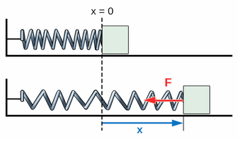

# Étude physique

Cette partie présente les principaux phénomènes physiques intervenant dans le fonctionnement de la catapulte.

Le modèle retenu est une catapulte en H utilisant un bras de levier et un ressort de traction comme système de propulsion.

L'objectif est d'étudier le comportement du ressort ainsi que la trajectoire du projectile, puis de comparer les résultats théoriques avec les résultats obtenus sur le prototype réel.

---

## 1. Fonctionnement physique de la catapulte

Lorsque la catapulte est armée, le bras est abaissé et le ressort est étiré.

Le ressort garde alors de l'énergie potentielle élastique.

Lors du déclenchement, le ressort se contracte et entraîne la rotation du bras. Une partie de l'énergie stockée est alors donné au projectile.

Ressort étiré -> énergie stockée -> rotation du bras -> lancement du projectile -> trajectoire

---

## 2. Loi de Hooke

La loi de Hooke permet de relier l'allongement d'un ressort à la force qu'il exerce.

F = k x Δx

avec :

- F : force exercée par le ressort en newtons (N)
- k : raideur du ressort en N/m
- Δx : allongement du ressort en mètres

Plus le ressort est étiré, plus la force qu'il exerce augmente.

### Application à mon ressort

Le ressort utilisé pour le prototype mesure environ :

L₀ = 3 cm = 0,03 m

Lors d'un premier essai manuel, il peut être étiré jusqu'à environ :

L = 6 cm = 0,06 m

L'allongement correspondant est donc :

Δx = L - Lo

Δx = 6 - 3 = 3 cm

soit :

Δx = 0,03 m

La valeur de la raideur k sera déterminée expérimentalement lors des essais.

Source : [Labster - Loi de Hooke](https://theory.labster.com/fr/hookes-law/)

---

## 3. Énergie potentielle élastique

Lorsqu'un ressort est étiré, il stocke de l'énergie appelée énergie potentielle élastique.

Cette énergie est donnée par :

E = 1/2 × k × (Δx)²

avec :

- E : énergie stockée en joules (J)
- k : raideur du ressort en N/m
- Δx : allongement du ressort en mètres

Plus le ressort est étiré, plus l'énergie qu'il stocke est importante.

Dans la catapulte, cette énergie est accumulée lorsque le bras est maintenu en position armée.

Lors du déclenchement, elle est transformée en mouvement du bras puis en mouvement du projectile.

Toute l'énergie stockée n'est cependant pas transmise au projectile. Une partie est perdue à cause des frottements, des vibrations et du mouvement des différentes pièces.

Source théorique : [Energy Education - Énergie potentielle élastique](https://energyeducation.ca/fr/%C3%89nergie_potentielle_%C3%A9lastique)

---

## 4. Trajectoire du projectile

Après avoir quitté le bras de la catapulte, le projectile suit une trajectoire sous l'effet de sa vitesse initiale et de la gravité.

La vitesse initiale peut être décomposée en deux composantes :

vx = v₀ × cos(θ)

vy = v₀ × sin(θ)

avec :

- v₀ : vitesse initiale du projectile en m/s
- θ : angle de lancement
- vx : vitesse horizontale
- vy : vitesse verticale

Les équations horaires permettant de décrire la trajectoire sont :

x(t) = v₀ × cos(θ) × t

y(t) = h₀ + v₀ × sin(θ) × t - 1/2 × g × t²

avec :

- x(t) : position horizontale du projectile
- y(t) : position verticale du projectile
- h₀ : hauteur de départ
- g : accélération de la pesanteur, environ 9,81 m/s²
- t : temps

Ces équations permettront ensuite de déterminer la trajectoire du projectile et sa portée à partir des valeurs obtenues expérimentalement.

Source théorique : TP Bille sur un rail - Physique 2.

---

## 5. Portée du projectile

La portée correspond à la distance horizontale parcourue par le projectile entre son point de lancement et son point d'impact.

Pour déterminer cette portée, il faut d'abord déterminer le moment où le projectile atteint le sol.

Pour cela, on utilise l'équation verticale :

y(t) = 0

Une fois le temps de vol déterminé, la portée peut être calculée avec l'équation horizontale :

R = v₀ × cos(θ) × t

avec :

- R : portée du projectile en mètres
- v₀ : vitesse initiale en m/s
- θ : angle de lancement
- t : temps de vol en secondes

Cette portée calculée pourra ensuite être comparée avec la portée mesurée lors des essais réels.

---

## 6. Simulation avec Algodoo

Une simulation simplifiée de la catapulte a été réalisée avec Algodoo afin de visualiser le mouvement du bras et la trajectoire du projectile avant la fabrication du prototype.

La simulation représente notamment :

- le plateau
- le support
- le bras de lancement
- le ressort
- le système de blocage
- le projectile

La trajectoire du projectile est visible grâce au traceur présent dans la simulation.

La trajectoire obtenue est approximativement parabolique, ce qui correspond au comportement attendu pour un projectile soumis principalement à la gravité.

Certaines valeurs utilisées dans la simulation sont encore provisoires, notamment la raideur du ressort.

Lorsque les mesures expérimentales auront été réalisées, les valeurs réelles pourront être utilisées afin de rendre la simulation plus proche du prototype.

---
